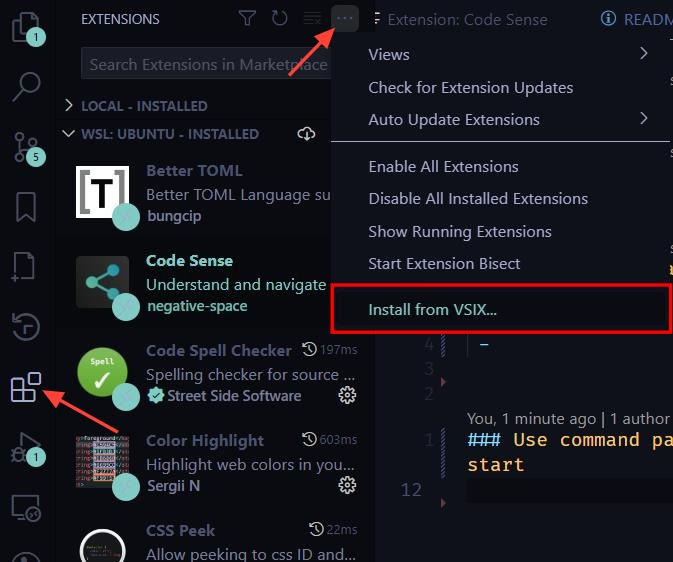

# Code Sense

# Install

## This extension uses a Proposed API and requires extra steps to install

### 1. Make sure you are using the insider version of VSCode 

It is pretty much the same as normal VSCode but gets updates sooner and has access to Proposed APIs

Download here https://code.visualstudio.com/insiders/

### 2. Download latest `code-sense-X.X.X.vsix` file and install using the "Installe from VSIX..." option in the extensions menu




### 3. Enable proposed APIs for this extension

- Open the command pallette (Ctrl+Shift+P) and enter `Preferences: Configure Runtime Arguments`
- Add the following to the list of arguments

```json
{
    ...
    "enable-proposed-api": ["negative-space.code-sense"]
}
```

### 4. Restart VSCode


# Start 

## Use command pallet to run `code-sense.start`

